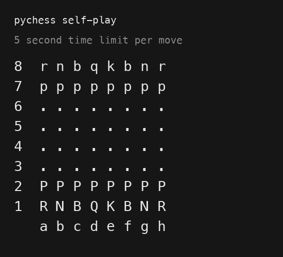

# pychess

[](https://github.com/cjunius/pyChess/actions/workflows/ci.yml)
[](pyproject.toml)
[](https://codecov.io/gh/cjunius/pyChess)
[](LICENSE)
[](https://github.com/astral-sh/ruff)

A UCI chess engine in Python. `Negamax` (fail-soft alpha-beta with a
check-aware quiescence search) is the core; it takes an evaluator, a move
orderer, a transposition table, and a clock as constructor arguments.
`lazy_smp.search` runs one iterative-deepening `Negamax` per worker process
against a shared-memory transposition table and returns the deepest completed
line. Evaluation is PeSTO - tapered mid/endgame piece-square tables kept as an
incremental accumulator on the board. See [docs/design.md](docs/design.md) for
the full feature list and backlog.



*Self-play at 5 s/move - every move a real search, no opening book.*

## Estimated Engine Strength

Around **1800–2000 Elo** at blitz, most likely ~1900. This is a feature-based
estimate from the search and evaluation, **not a measured result** - no games
against rated opposition have been run yet.

| Time control | Estimate | Why |
|---|---|---|
| Bullet (1+0) | ~1600–1750 | Python per-move overhead dominates. |
| Blitz (3+2 / 5+3) | ~1850–2000 | Reaches depth 6–8. |
| Rapid / Classical | ~2000–2150 | Reaches depth 9–10+; PeSTO scales well with depth. |
| Lichess bot pool | ~1950–2200 blitz | Bot ratings there tend to run higher than CCRL. |

See [docs/engine-strength.md](docs/engine-strength.md) for how the number is
derived, calibration against known engines, and how to turn it into a measured
rating; [docs/performance.md](docs/performance.md) for search-speed benchmarks.

## Quick start

Requires Python 3.14+.

```bash
git clone https://github.com/cjunius/pyChess.git
cd pyChess
pip install -e .          # add ".[dev]" for the test / lint tools
pychess                   # UCI loop on stdin/stdout (also: python -m pychess)
```

Point any UCI GUI (CuteChess, Arena, a Lichess bot harness) at the `pychess`
command.

## Usage

Standard UCI: `uci`, `isready`, `ucinewgame`, `position`, `go`, `stop`, `quit`.

`go` accepts `depth <n>`, `movetime <ms>`, `nodes <n>`, `wtime/btime/winc/binc/movestogo <ms>`,
or `infinite`; a bare `go` searches for ~4s. Every search runs Lazy SMP - one
worker process per core, sharing a lock-free transposition table.

Extra commands: `perft <depth>`, `selfPlay`, `printBoard`, `printLegalMoves`,
`printMoveStack`.

## Repository layout

```
pychess/
├── pyproject.toml         packaging, dependencies, ruff / mypy / pytest / coverage config
├── src/pychess/
│   ├── __main__.py        UCI protocol loop; `pychess` / `python -m pychess` entry point
│   ├── engine.py          Engine - assembles the default search
│   ├── lazy_smp.py        Lazy SMP coordinator + worker; returns a SearchResult
│   ├── negamax.py         Negamax - fail-soft negamax + quiescence over injected pieces
│   ├── move_ordering.py   MoveOrderer - TT move / MVV-LVA / killers / history
│   ├── evaluation.py      PeSTO tables + PestoEvaluator
│   ├── eval_board.py      EvalBoard - chess.Board with an incremental eval accumulator
│   ├── transposition.py   TranspositionTable - in-process dict
│   ├── shared_tt.py       SharedTT / SharedFlag - lock-free shared-memory table
│   ├── clock.py           Clock + deadline_from_limits (UCI time management)
│   ├── constants.py       mate / window / TT-flag constants
│   ├── types.py           shared type aliases (GoLimits)
│   └── perft.py           move-generation node counter
├── tests/                 pytest suite, one test_<module>.py per source module
├── opening_book/          Polyglot opening book (see opening_book/README.md)
└── docs/
    ├── design.md          architecture, feature list, backlog
    ├── engine-strength.md  playing-strength estimate and how to measure it
    ├── performance.md      benchmark tables (search speed, Lazy SMP scaling)
    └── tasks.md            prioritised roadmap + what's already done
```

## Development

```bash
pip install -e ".[dev]"
pre-commit install       # optional: runs the checks below on every commit

ruff check .             # lint
ruff format --check .    # formatting
mypy                     # type-check src/ (strict) and tests/
pytest                   # tests + coverage (gate: 85%)
```

CI (`.github/workflows/ci.yml`) runs lint + format + type-check once and the
test suite on Python 3.14. All tool config lives in `pyproject.toml`.

## License

[Apache-2.0](LICENSE). The bundled opening book has separate provenance -
see [opening_book/README.md](opening_book/README.md).
